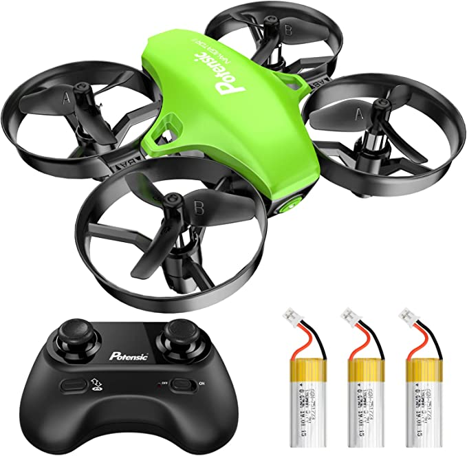

# ESE519_Final
For ESE 519 Final project. Drone with learning.

- **code:**
  - **working:**
    - RP2040
    - balance board Python code
    - PIO PWM code on PIO 0:修改到没有main只有调用的样式
    - I2C communication on PIO 1 from lab 2B
  - **in-progress:**
    - Pico4ML
    - Machine learning
    - gyroscope
  - **libraries:**
    - pwm.pio, uart_rx.pio, uart_tx.pio
    - pico_stdlib, hardware_pio, hardware_pwm
    - pico_multicore
  - **reference:**
    - https://cla.purdue.edu/academic/rueffschool/ad/etb/resources/robotics01_SN754410_Arduino.pdf
- **media:**
  - **materials:**
    - Pico4ML
    
    

    - MiniDrone

    

    - RP2040
    
    

  - **design:**
 
 
  
  - **troubleshooting:**
    - 如何从0开始让扇叶转动
    - 使用示波器hack无人机原有电路得知舵机是DC输入
    - pwm转DC
    - 调整pwm让舵机可以以不同速度转动
  - **demos:**
    - video
    The demo is given as follows:
    
    
    - circuit connection
    
    

- **diagram:**
 - 画一张完整的图片 包含全部的设计
